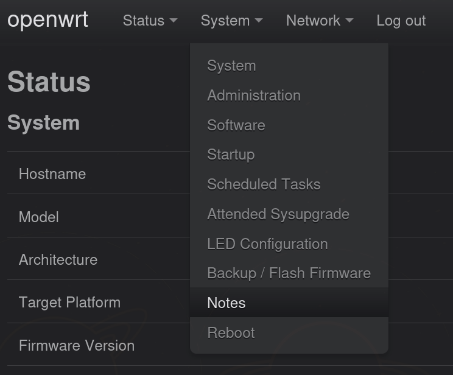
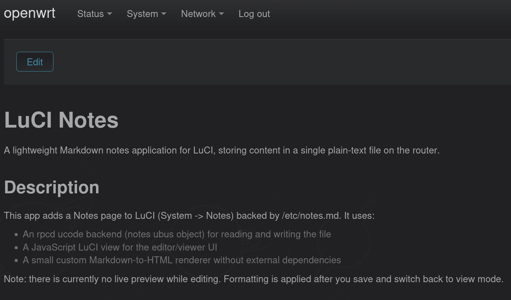
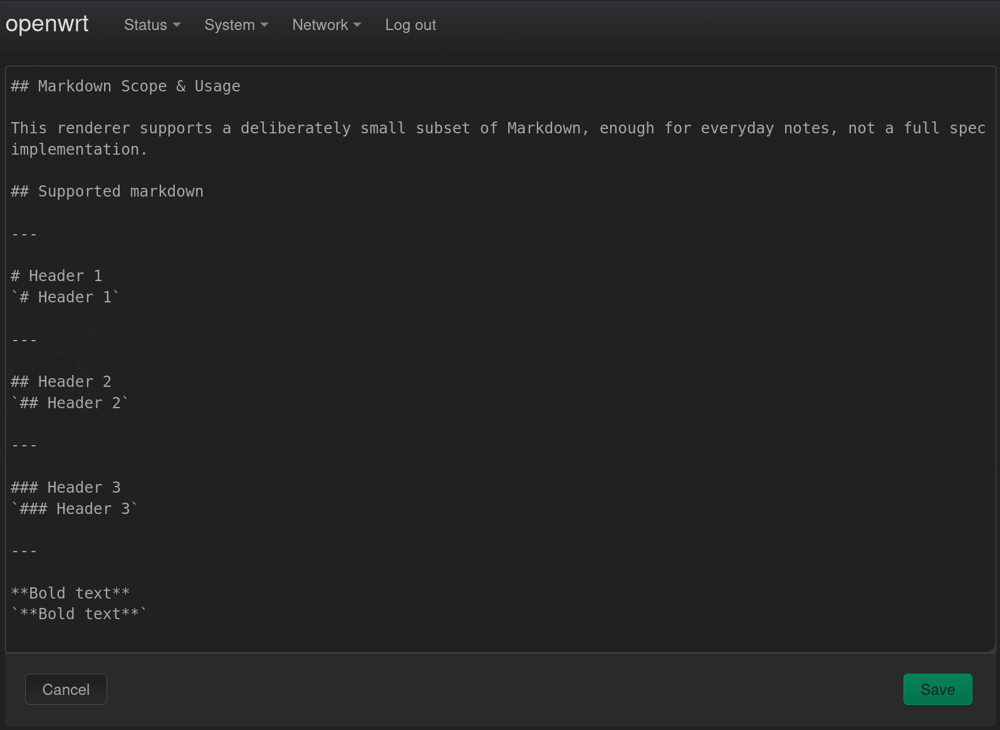
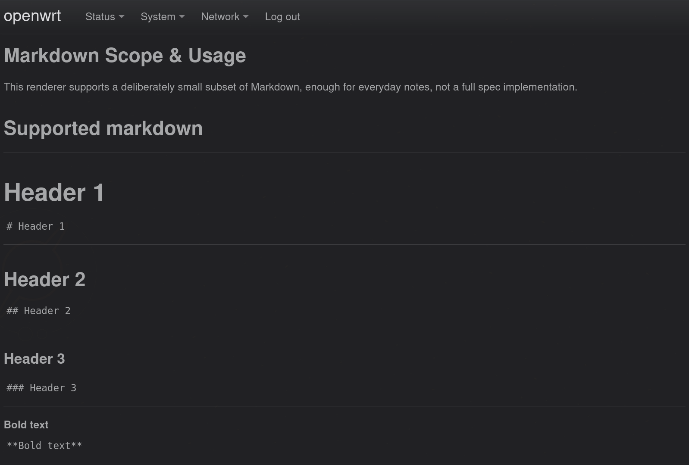

# LuCI Notes

A lightweight Markdown notes application for LuCI, storing content in a single plain-text file on the router. 

## Description

This app adds a Notes page to LuCI (System -> Notes) backed by /etc/notes.md. It uses:

- An rpcd ucode backend (notes ubus object) for reading and writing the file
- A JavaScript LuCI view for the editor/viewer UI
- A small custom Markdown-to-HTML renderer without external dependencies

Note: there is currently no live preview while editing. Formatting is applied after you save and switch back to view mode.


## Installation

This repository currently provides .apk packages for OpenWrt releases using the APK package format.

There is currently no custom package repository, so the package is not signed by a trusted repository.

Download the latest `.apk` from the [Releases page](https://github.com/vikzil/luci-app-notes/releases/latest), then install it directly with --allow-untrusted:

```
apk add --allow-untrusted /path/to/luci-app-notes-0.1.0-r1.apk
```

After installing, log in to LuCI and go to System -> Notes.

The file /etc/notes.md is a conffile, so it survives package upgrades and will not be overwritten if you have already edited it.

Uninstalling the package does not automatically delete /etc/notes.md. Remove it manually if you want a clean slate.

Note: installing or uninstalling this package restarts rpcd to register/unregister its RPC backend. If you're logged in to LuCI at the time, you'll be logged out and need to log back in.


## Build Notes

- Place the package under package/luci-app-notes/.
- Run `make menuconfig` and make sure luci-app-notes is selected under:
  LuCI ---> 3. Applications --->
- Build just this package:
  make package/luci-app-notes/{clean,prepare,compile} V=s
- Verify that the package has been built:
```
find bin/packages -iname '*luci-app-notes*'
```

## Markdown Scope & Usage

This renderer supports a deliberately small subset of Markdown, enough for everyday notes, not a full spec implementation.

## Supported markdown

---

# Header 1
`# Header 1`

---

## Header 2
`## Header 2`

---

### Header 3
`### Header 3`

---

**Bold text**
`**Bold text**`

---

__Also bold text__
`__Also bold text__`

---

*Italic text*
`*Italic text*`

---

_Also italic text_
`_Also italic text_`

---

Inline `code` like this
\`code\`

---

> A blockquote
`> A blockquote`

---

- Unordered list item one
- Unordered list item two
+ Unordered list item three
+ Unordered list item four
* Unordered list item five
* Unordered list item six
`- Unordered list item one`
`- Unordered list item two`
`+ Unordered list item three`
`+ Unordered list item four`
`* Unordered list item five`
`* Unordered list item six`

---

1. Ordered list item one
2. Ordered list item two
`1. Ordered list item one`
`2. Ordered list item two`

---

```
function example() {
    return true;
}
```

\```
function example() {
    return true;
}
\```

--- 

Special characters can be escaped using a backslash:

\*\*This text is not bold, because asterisks are escaped\*\*
`\*\*This text is not bold, because asterisks are escaped\*\*`

---

Horizontal rules:

`---`

---

## Not supported
- Links 
- Images
- Tables
- Nested lists
- HTML passthrough (input is escaped and not interpreted)
- Live preview while editing

---

## Screenshots

**Menu location**



**View mode**



**Edit mode**



**Rendered result**


